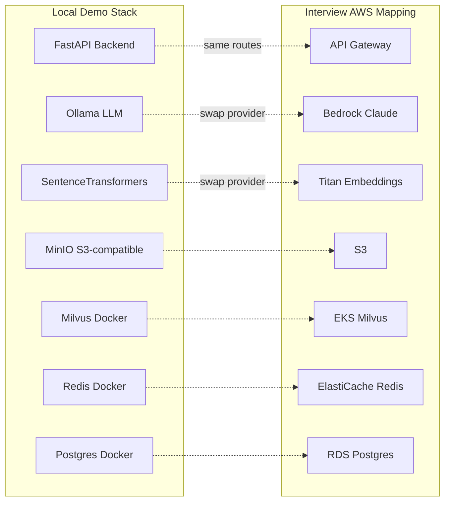
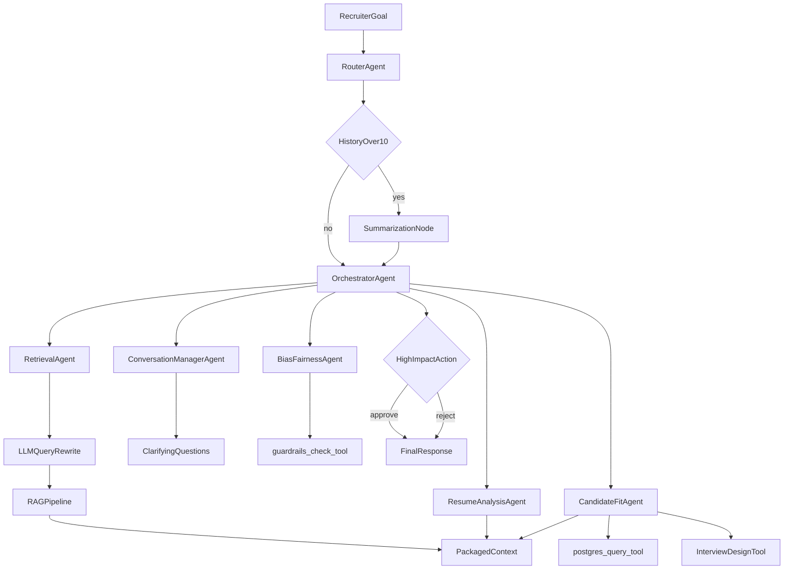
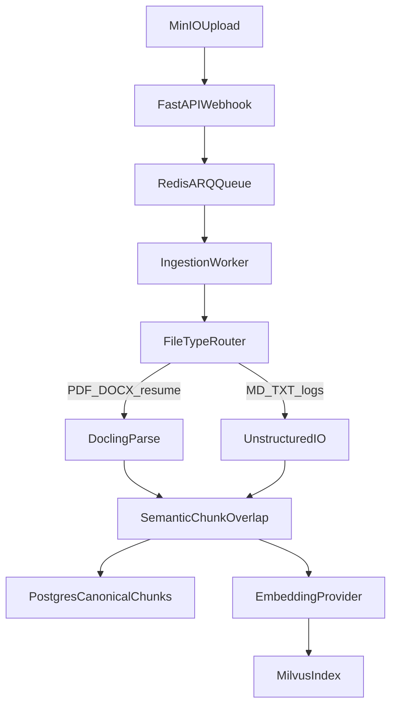
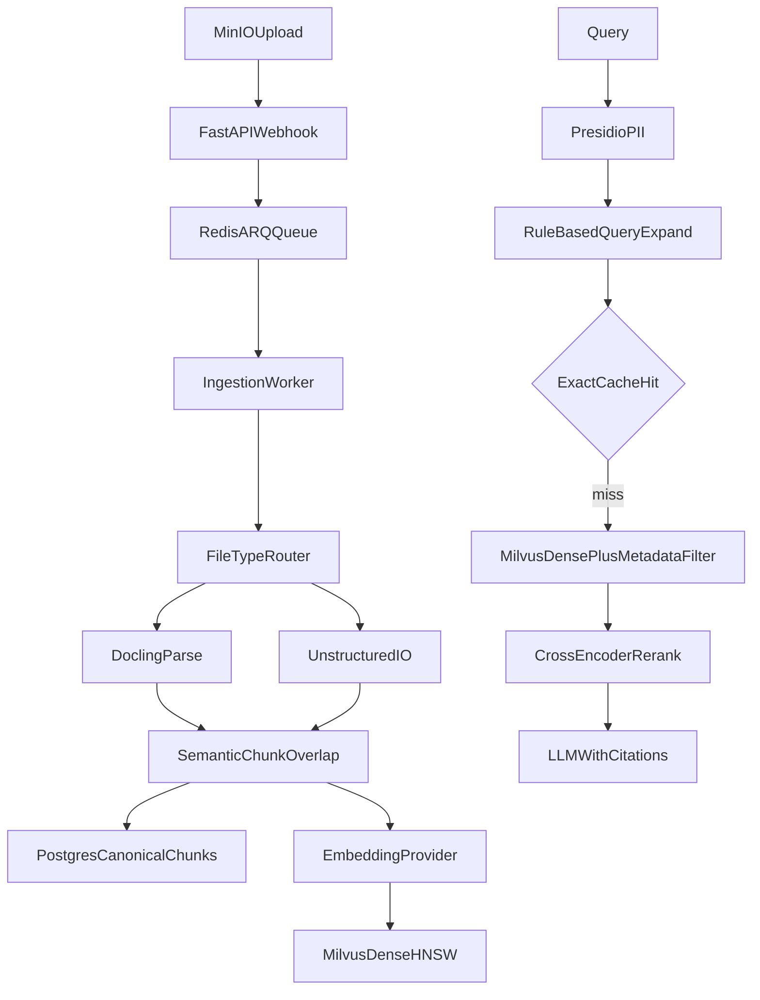
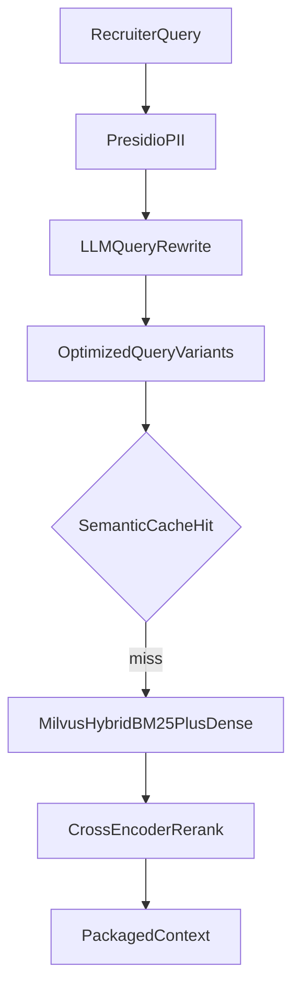
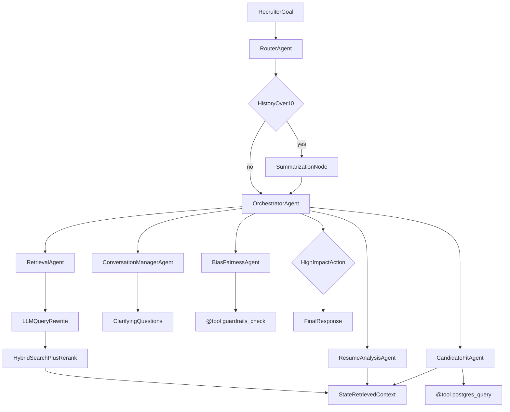

# TalentScreen: Local Portfolio Build Plan (v4.1 — Resume-Aligned)

> **Purpose:** Build a local, Docker-based RAG + LangGraph multi-agent hiring platform that implements every resume bullet via real code, with local equivalents for AWS services and Terraform docs for interview justification.

## Revision summary

### v1 → v2 (scope & timeline review)

| Issue | Fix applied |
|---|---|
| 8–9 week timeline unrealistic | **4–6 week accelerated MVP** with explicit scope cuts |
| Hybrid search contradiction | **Phase 1a dense-first**, Phase 1b adds BM25 hybrid |
| Postgres + Milvus chunk drift | **Postgres = canonical chunks**, Milvus = vectors keyed by `chunk_id` |
| Eval metrics mixed | **Separate metric table** with thresholds and CI gates |

### v2 → v3 (architecture hardening)

| Issue | Fix applied |
|---|---|
| Redis Blackboard + checkpointer dual state | **LangGraph State is sole blackboard**; Redis = query cache + ARQ queue only |
| ARQ summarization race | **SummarizationNode** inside graph (synchronous, >10 messages) |
| Small Ollama models fail routing/JSON/tools | **`llama3.1:8b-instruct` / `qwen2.5:7b-instruct`** + `LLM_PROVIDER` fallback |
| MCP debugging too early | **Native `@tool` first**; MCP wrappers in Phase 2b final step |

### v3 → v4 (resume alignment — Gemini feedback)

| Issue | Fix applied |
|---|---|
| Router merged into Orchestrator; Retrieval demoted to tool | **Restored 6 distinct agent nodes** matching resume capability names |
| LLM query rewrite marked optional | **Mandatory in Phase 1b** — LLM-driven rewrite before retrieval |
| Unstructured.io deferred | **Unified file-type router** — Docling for PDF/DOCX; Unstructured for md/txt/logs |
| Promptfoo deferred post-MVP | **Promptfoo in Phase 1b** — `eval/promptfoo/promptfoo.yaml` + `npx promptfoo eval` |
| FeedbackSynthesis as 7th agent | **Merged into Orchestrator aggregation**; 6 agents match resume list exactly |

### v4 → v4.1 (bias agent split — Cursor review)

| Issue | Fix applied |
|---|---|
| ConversationManager merged bias/guardrails duties | **Split BiasFairnessAgent** into its own node (`bias_fairness.py`) — dedicated demo path for guardrails resume bullet |
| ConversationManager overloaded | **ConversationManagerAgent** now owns only dialogue continuity + clarifying questions |

**Agent count:** 7 agent nodes + SummarizationNode utility. Feedback synthesis remains in Orchestrator aggregation.

---

## Your decisions (locked in)

| Decision | Your choice |
|---|---|
| Scope | Phased MVP (RAG → agents) + portfolio demo |
| Vector DB | **Milvus** (local Docker; EKS in Terraform) |
| Deployment | **Local only** — no AWS credentials required |
| AWS services | Local equivalents + Terraform swap-in docs |
| UI | **React** (recruiter + minimal candidate) + **Streamlit** (minimal debug) |
| Data | Public datasets + synthetic documents |
| Timeline | **4–6 weeks** accelerated MVP with Cursor assistance |
| IaC | **Terraform** (`infra/aws/*.tf`) |
| Agent topology | **7 canonical agents** — routing, orchestration, retrieval, matching (×2), conversation, bias/fairness (resume-aligned) |

---

## Local vs AWS constraint



---

## State management philosophy

**LangGraph State is the single blackboard — no Redis blackboard.**

| Concern | Owner |
|---|---|
| Execution plan, task statuses, messages, summaries, retrieved context | **LangGraph State** + Postgres checkpointer |
| HITL resume | Postgres checkpointer — `POST /agents/resume/{thread_id}` |
| Query result caching | Redis `ts:cache:*` |
| Ingestion jobs | Redis `ts:queue:ingest` (ARQ) |

---

## Canonical agent inventory (7 agents — resume-aligned)

**One LangGraph graph, 7 distinct agent nodes + 1 utility node (SummarizationNode).** Each agent maps to a file under `src/agents/nodes/`.



| Agent | File | Resume capability | Responsibility |
|---|---|---|---|
| **RouterAgent** | `nodes/router.py` | **Routing** | Ingress: classify intent (Hiring / Policy / Scheduling); reject or forward |
| **OrchestratorAgent** | `nodes/orchestrator.py` | **Orchestration** | Build execution plan, delegate sub-goals, aggregate outputs (incl. feedback note synthesis) |
| **RetrievalAgent** | `nodes/retrieval.py` | **Retrieval** | Query optimization, LLM rewrite, RAG pipeline, cross-encoder rerank, package context |
| **ResumeAnalysisAgent** | `nodes/resume_analysis.py` | **Candidate matching** | Normalize skills/experience; compare candidates |
| **CandidateFitAgent** | `nodes/candidate_fit.py` | **Candidate matching** | Score vs JD, gaps, confidence; generate interview questions |
| **ConversationManagerAgent** | `nodes/conversation_manager.py` | **Conversation management** | Dialogue continuity, clarifying questions, thread context handoff |
| **BiasFairnessAgent** | `nodes/bias_fairness.py` | **Guardrails / bias** | Flag biased language; Presidio PII + detoxify toxicity on notes and outputs |

**SummarizationNode** (`nodes/summarization.py`): utility node — compresses history when >10 messages; writes `state.summary` synchronously.

**Interview demo paths:**
- *"Show me your routing agent"* → `src/agents/nodes/router.py`
- *"Show me query rewriting and reranking"* → `src/agents/nodes/retrieval.py`
- *"Show me your bias and guardrails agent"* → `src/agents/nodes/bias_fairness.py`

### LangGraph State schema

```python
class AgentState(TypedDict):
    messages: Annotated[list, add_messages]
    intent: str                          # hiring | policy | scheduling | out_of_scope
    execution_plan: list[SubGoal]        # pending | running | done
    task_results: dict[str, Any]
    retrieved_context: list[ChunkRef]    # packaged by RetrievalAgent
    rewritten_queries: list[str]         # LLM rewrite variants from RetrievalAgent
    summary: str | None
    candidate_id: str | None
    job_id: str | None
    pending_approval: dict | None
```

### Resume capability → agent mapping

| Resume lists | Implemented by |
|---|---|
| conversation management | ConversationManagerAgent + SummarizationNode |
| retrieval | RetrievalAgent |
| candidate matching | ResumeAnalysisAgent + CandidateFitAgent |
| routing | RouterAgent |
| orchestration | OrchestratorAgent |
| guardrails / bias / PII / toxicity | BiasFairnessAgent (`guardrails_check` tool) |

---

## Data model

| Store | Role | Keys |
|---|---|---|
| **Postgres** | Canonical chunks, metadata, checkpointer tables | `chunk_id` (UUID) |
| **Milvus** | Retrieval index: embeddings + sparse vectors + metadata | `chunk_id` FK |
| **MinIO** | Raw files | `document_id` |
| **Redis** | Query cache + ARQ ingestion queue only | prefixed keys |

- **Citation validation:** `chunk_id` in LLM output → validate against Postgres + retrieval set.
- **Ingestion idempotency:** `(tenant_id, content_hash)` unique constraint.

---

## Redis data model

| Prefix | Purpose | TTL |
|---|---|---|
| `ts:cache:query:{hash}` | Exact-match retrieval cache | 1h |
| `ts:cache:semantic:{tenant}` | Semantic vector query cache (Phase 1b) | 24h |
| `ts:queue:ingest` | ARQ ingestion queue | n/a |

---

## Ingestion architecture (Docling + Unstructured)

Unified file-type router in `src/ingestion/router.py`:



| File type | Parser | Rationale |
|---|---|---|
| PDF, DOCX (structured resumes) | **Docling** | Preserves tables, headers, layout |
| Markdown, TXT, interview feedback logs | **Unstructured.io** | Cleans raw text, extracts metadata |
| Unknown | Unstructured.io fallback | Graceful degradation |

---

## Local LLM strategy and developer fallback

| Model | Role |
|---|---|
| `llama3.1:8b-instruct` | Default local — tool calling, JSON mode |
| `qwen2.5:7b-instruct` | Alternative local |

| `LLM_PROVIDER` | Backend |
|---|---|
| `ollama` (default) | Local Ollama |
| `anthropic` | Claude 3.5 Haiku (dev graph validation) |
| `groq` | Groq-hosted models |

Production maps to **Bedrock Claude Sonnet** via same `LLMProvider` interface + typed Bedrock stub.

---

## Repository structure

```
├── docker-compose.yml
├── pyproject.toml              # uv-managed (Python deps only)
├── .env.example
├── src/
│   ├── ingestion/
│   │   ├── router.py           # file-type router (Docling vs Unstructured)
│   │   ├── docling_parser.py
│   │   └── unstructured_parser.py
│   ├── retrieval/
│   │   ├── query_rewrite.py    # mandatory LLM rewrite (Phase 1b)
│   │   └── ...
│   ├── generation/
│   ├── agents/
│   │   ├── graph.py
│   │   └── nodes/
│   │       ├── router.py
│   │       ├── orchestrator.py
│   │       ├── retrieval.py
│   │       ├── resume_analysis.py
│   │       ├── candidate_fit.py
│   │       ├── conversation_manager.py
│   │       ├── bias_fairness.py
│   │       └── summarization.py
│   │   └── tools/              # native @tool (Phase 2a)
│   ├── mcp/                    # thin wrappers (Phase 2b final)
│   ├── api/
│   └── observability/
├── frontend/react/
├── admin/streamlit/
├── eval/
│   ├── golden_sets/
│   ├── deepeval/
│   └── promptfoo/
│       ├── promptfoo.yaml      # Phase 1b — few-shot variant comparison
│       └── README.md
├── infra/aws/
├── tests/
└── docs/
```

---

## Resume bullet → module mapping (100% aligned)

| Resume bullet | Module | Local implementation |
|---|---|---|
| AI talent platform (RAG + multi-agent) | End-to-end | React + FastAPI + 7 agents + RAG |
| LangGraph: conversation, retrieval, matching, routing, orchestration | `src/agents/nodes/` | 7 distinct agent nodes (see table above) |
| MCP tool infrastructure | `src/mcp/` (Phase 2b) | Native `@tool` first; 2 MCP wrappers |
| **Unstructured.io and Docling** | `src/ingestion/` | **File-type router — both parsers live** |
| Semantic chunking + Titan embeddings | chunking + embeddings | Docling overlap; sentence-transformers provider |
| Milvus hybrid + HNSW | `src/retrieval/milvus/` | Dense 1a; BM25 hybrid 1b |
| Cross-encoder reranking + F1@K | reranker + eval | Inside RetrievalAgent + eval metrics |
| **Query rewriting** + Presidio | `query_rewrite.py` + guardrails | **Mandatory LLM rewrite in 1b** + Presidio |
| Redis semantic query cache | `src/retrieval/cache/` | Exact 1a; semantic vector 1b |
| Prompting + **Promptfoo** | prompts + `eval/promptfoo/` | **Few-shot variants + `npx promptfoo eval` in 1b** |
| Bedrock Claude + prompt cache | `src/generation/llm/` | Ollama/Haiku/Groq + hash cache + Bedrock stub |
| CI/CD DeepEval | `.github/workflows/` | eval.yml gates |
| AWS + HF guardrails | `nodes/bias_fairness.py` | Presidio + detoxify via **BiasFairnessAgent** |
| API Gateway + React (recruiter + candidate) | api + frontend | FastAPI + React pages |
| Langfuse observability | observability | Traces per agent node + retrieval steps |

---

## Phase 1a: Core RAG (Week 1–2)



### Build tasks (1a)

1. Repo scaffold: `src/` layout, **uv**, `pyproject.toml`
2. `docker-compose.yml`: Milvus, Redis Stack, Postgres, MinIO, Langfuse
3. Provider interfaces: `EmbeddingProvider`, `LLMProvider` + typed Bedrock stub
4. **Golden set JSON (20–30 Q&A + `chunk_id`s) — week 1, before tuning**
5. Ingestion: MinIO → FastAPI webhook → ARQ worker
6. **Unified file-type router** — Docling (PDF/DOCX) + Unstructured (md/txt/logs)
7. Postgres schema + Milvus dense collection keyed by `chunk_id`
8. Dense retrieval + metadata filters + cross-encoder rerank
9. Rule-based query expansion (pre-LLM-rewrite baseline)
10. Exact-match Redis cache
11. Presidio PII on input
12. Generation: JSON output, citation validation, few-shot prompts, prompt prefix hash cache
13. FastAPI: `/ingest`, `/query`, `/health`, `/degraded`
14. Minimal Streamlit debug page
15. Langfuse tracing
16. Minimal `ci.yml`: lint + unit tests
17. Error handling: Milvus down, Ollama timeout, empty retrieval

### Phase 1a demo script

1. Upload PDF resume (Docling path) + TXT interview notes (Unstructured path)
2. Ask: "Who best matches Java + 5 years cloud?"
3. Show Streamlit: dense scores → rerank → citations
4. Show Langfuse trace
5. Re-upload same doc → idempotent skip

---

## Phase 1b: Hybrid + LLM rewrite + Promptfoo (Week 2–3) — all mandatory



### Build tasks (1b) — nothing optional

1. **LLM query rewrite (mandatory):** intercept raw recruiter input → expand synonyms, fix recruitment terminology, generate 2–3 optimized query variants before retrieval
2. Milvus BM25 sparse field + RRF hybrid fusion (after dense golden set passes)
3. Redis semantic query cache (`ts:cache:semantic:*`)
4. Expand golden set to 40–50 pairs
5. F1@K ranking metrics
6. DeepEval: faithfulness, context recall, answer relevance
7. **`eval.yml` CI gates**
8. **Promptfoo (mandatory):**
   - Create `eval/promptfoo/promptfoo.yaml` with 2–3 few-shot prompt variants
   - Create assertion matrix for Q&A, fit scoring tasks
   - Run locally: `npx promptfoo eval`
   - Document in README; optional weekly `promptfoo.yml` CI job

### Phase 1b demo script

1. Show LLM rewrite: raw query → rewritten variants in Streamlit/Langfuse
2. Show hybrid retrieval improvement vs dense-only (F1@5 delta)
3. Run `npx promptfoo eval` — show variant comparison table
4. Run `deepeval` — show faithfulness/context recall scores separately from F1@5

---

## Eval metrics table

| Metric | Measures | Threshold | Enforced by |
|---|---|---|---|
| F1@5 | Retrieval ranking vs golden `chunk_id`s | >= 0.60 | `eval.yml` |
| Context recall (DeepEval) | Retrieved context covers answer | >= 0.70 | `eval.yml` |
| Faithfulness (DeepEval) | Answer grounded in context | >= 0.75 | `eval.yml` |
| Answer relevance (DeepEval) | Answer addresses question | >= 0.70 | `eval.yml` |
| Promptfoo pass rate | Prompt variant assertions | >= 80% | local + optional CI |
| Latency p95 | End-to-end `/query` | < 8s local | `ci.yml` warn |

---

## Phase 2: LangGraph 7-agent graph (Week 3–4)

Split: **2a** native `@tool` + 7-agent graph; **2b** MCP wrappers last.

### Phase 2a: 7 agents + native tools (Week 3)



**Build order (2a):**

1. `AgentState` schema (includes `retrieved_context`, `rewritten_queries`)
2. Native `@tool` functions in `src/agents/tools/`:
   - `rag_retrieve` — wraps Phase 1b pipeline (rewrite + hybrid + rerank)
   - `postgres_query` — read-only SQL with RBAC
   - `guardrails_check` — Presidio + toxicity
3. **RouterAgent** — intent classification; forward or reject
4. **SummarizationNode** — conditional edge at >10 messages
5. **OrchestratorAgent** — execution plan + delegation + aggregation (includes feedback note synthesis in aggregate step)
6. **RetrievalAgent** — owns query rewrite + RAG + context packaging; showcase node for retrieval walkthrough
7. **ResumeAnalysisAgent** — skills normalization, candidate comparison
8. **CandidateFitAgent** — JD fit scoring, gaps, interview question design tool
9. **ConversationManagerAgent** — clarifying questions, dialogue continuity, thread context
10. **BiasFairnessAgent** — biased language detection, Presidio PII, detoxify toxicity on notes/outputs
11. HITL: `interrupt_before` on high-impact actions
12. Postgres checkpointer
13. Validate with `LLM_PROVIDER=anthropic` or `groq` if Ollama routing fails

### Phase 2b: MCP wrappers (Week 4 — final step)

Thin wrappers over verified `@tool` functions — zero logic rewrite:

| MCP server | Wraps |
|---|---|
| `rag-server` | `agents.tools.rag.rag_retrieve` |
| `postgres-server` | `agents.tools.postgres.postgres_query` |

### Memory architecture

| Layer | Implementation |
|---|---|
| Short-term + blackboard | LangGraph State + Postgres checkpointer |
| Mid-term summarization | SummarizationNode (in-graph, synchronous) |
| Long-term Milvus memory | Deferred — documented in `aws-mapping.md` |

### Phase 2 demo scenarios

1. Open `router.py` — show Hiring vs Policy routing
2. Open `retrieval.py` — show LLM rewrite → hybrid search → rerank → packaged context
3. Multi-agent compare + bias flag (**BiasFairnessAgent** — open `bias_fairness.py`)
4. HITL reject path
5. Empty retrieval
6. PII in query
7. Tenant filter (two tenants, different results)
8. Tool failure / ablation (disable postgres tool)
9. SummarizationNode at message 11
10. MCP equivalence test (2b): in-process `@tool` vs MCP wrapper

---

## Phase 3: React + guardrails + Terraform (Week 4–5)

### React pages

| Page | Audience |
|---|---|
| Document upload | Recruiter |
| Candidate search + agent chat | Recruiter |
| Approval inbox (HITL) | Recruiter |
| Job listings + apply form | Candidate |
| Application status view | Candidate |

### Auth, guardrails, Terraform

- MVP auth: `X-API-Key` + role (`recruiter` | `candidate`)
- Guardrails: prompt injection heuristics (API layer) + Presidio + detoxify (via **BiasFairnessAgent**)
- Terraform: `s3.tf`, `lambda_ingest.tf`, `api_gateway.tf`, `bedrock_iam.tf`, `eks_milvus/`, `elasticache.tf`, `rds.tf`, `secrets_manager.tf`

---

## Scope: MVP vs deferred

| Item | MVP | Deferred |
|---|---|---|
| Docling ingestion (PDF/DOCX) | Yes (1a) | — |
| Unstructured.io (md/txt/logs) | Yes (1a) | — |
| Dense + metadata + rerank | Yes (1a) | — |
| Rule-based query expand | Yes (1a) | — |
| **LLM query rewrite** | **Yes (1b) — mandatory** | — |
| BM25 hybrid search | Yes (1b) | — |
| Semantic query cache | Yes (1b) | — |
| **Promptfoo** | **Yes (1b) — `npx promptfoo eval`** | CI weekly job optional |
| DeepEval + F1@K | Yes (1b) | — |
| **7 LangGraph agent nodes** | **Yes (2a)** | — |
| SummarizationNode | Yes (2a) | — |
| Native `@tool` functions | Yes (2a) | — |
| MCP server wrappers | Yes (2b final) | — |
| Mock calendar/ATS MCP | — | Post-MVP |
| Long-term Milvus memory | — | Documented only |
| React recruiter + candidate UI | Yes (3) | — |
| Streamlit | Minimal debug | Full dashboard |
| Terraform IaC docs | Yes (3) | — |
| Developer API fallback | Yes | — |
| Video transcription | — | Narrative only |

---

## Build checklist

- [ ] **Week 1:** Docker + uv scaffold + golden set + file-type router (Docling + Unstructured) + ARQ ingestion + Postgres/Milvus dense + ci.yml
- [ ] **Week 2:** Rerank + Presidio + generation + FastAPI + minimal Streamlit + Langfuse + error handling + LLM provider (Ollama + fallback env)
- [ ] **Week 2–3 (1b):** **Mandatory LLM query rewrite** + BM25 hybrid + semantic cache + F1@K + DeepEval + **Promptfoo (`npx promptfoo eval`)** + eval.yml gates
- [ ] **Week 3 (2a):** AgentState + native `@tool` + **7 agent nodes** (`router.py`, `orchestrator.py`, `retrieval.py`, `resume_analysis.py`, `candidate_fit.py`, `conversation_manager.py`, `bias_fairness.py`) + SummarizationNode + HITL + checkpointer
- [ ] **Week 4 (2b):** MCP wrappers (rag-server, postgres-server) + ablation demos + MCP equivalence test
- [ ] **Week 4–5:** React (recruiter + candidate) + guardrails + Terraform + docs (`resume-justification.md`, `narrative-alignment.md`, `aws-mapping.md`)
- [ ] **Per phase:** learning guide in `docs/learning/`

---

## Tech stack summary

| Layer | Local (runnable) | Resume / AWS (documented) |
|---|---|---|
| LLM (primary) | Ollama `llama3.1:8b-instruct` or `qwen2.5:7b-instruct` | Bedrock Claude Sonnet |
| LLM (dev fallback) | Claude 3.5 Haiku / Groq via `LLM_PROVIDER` | Same Bedrock interface |
| Embeddings | sentence-transformers | Titan Embeddings |
| Ingestion | Docling + Unstructured.io file router | S3 → Lambda |
| Vector DB | Milvus Docker | Milvus on EKS |
| Cache | Redis (query cache + ARQ queue) | ElastiCache |
| Structured DB | Postgres (data + checkpointer) | RDS |
| Orchestration | LangGraph — 7 agents + SummarizationNode | Same |
| Tools (2a) | Native `@tool` | — |
| Tools (2b) | 2 MCP wrappers | ECS MCP servers |
| Prompt eval | **Promptfoo (`npx`)** + Langfuse | Same |
| Eval | DeepEval + F1@K | CodeBuild |
| IaC | Terraform (reference) | Production path |
| Package manager | uv | — |

---

## Risks and mitigations

| Risk | Mitigation |
|---|---|
| Docling + Unstructured install weight | Pin versions; Dockerfile for ingestion worker |
| Local LLM routing failures | llama3.1:8b / qwen2.5:7b; `LLM_PROVIDER` swap to Haiku/Groq |
| 7 agents = more nodes to debug | Build one agent file at a time in 2a; Langfuse traces per node; BiasFairness is lightweight |
| Milvus hybrid complexity | Dense golden set must pass before hybrid in 1b |
| Dual state desync | LangGraph State only — no Redis blackboard (retained from v3) |
| MCP overhead early | Native `@tool` first; MCP only in 2b final step (retained from v3) |
| Aggressive timeline | Explicit MVP table; every resume bullet has a file path to demo |

---

## Narrative alignment (interview answers)

| Topic | What to say |
|---|---|
| 7 specialized agents | "Router, Orchestrator, Retrieval, ResumeAnalysis, CandidateFit, ConversationManager, BiasFairness — each is a distinct LangGraph node under `src/agents/nodes/`. Resume lists 5 capability types; matching spans two agents; guardrails has its own node." |
| Bias vs conversation split | "ConversationManager handles dialogue; BiasFairnessAgent owns Presidio, toxicity, and biased-language flags — show `bias_fairness.py`." |
| Query rewriting | "Mandatory LLM rewrite in Phase 1b pipeline; RetrievalAgent owns it in the agent graph — show `retrieval.py`." |
| Unstructured + Docling | "File-type router sends PDFs to Docling, text logs to Unstructured — both in `src/ingestion/router.py`." |
| Promptfoo | "Run `npx promptfoo eval` against few-shot variants in `eval/promptfoo/promptfoo.yaml`." |
| Redis blackboard | "Refactored to LangGraph State — Redis is cache and queue only." |
| MCP vs native tools | "`@tool` functions verified first; MCP wrappers in Phase 2b — zero logic duplication." |
| Feedback synthesis | "Orchestrator aggregates specialist outputs including merged interviewer notes — not a 7th agent." |

---

## Out of scope

- Real AWS deployment (no credentials)
- Real calendar/Gmail/ServiceNow integrations
- Video/audio transcription (narrative only)
- Production multi-tenant hardening
- Google ADK implementation
- Redis blackboard / ARQ summarization worker

---

## Learning modules (after each phase)

- **Phase 1:** `docs/learning/phase1-rag.md` — Docling vs Unstructured, chunking, HNSW, hybrid, LLM query rewrite, Promptfoo, Presidio, F1@K
- **Phase 2:** `docs/learning/phase2-agents.md` — 7-agent topology, RetrievalAgent + BiasFairnessAgent walkthroughs, LangGraph State, SummarizationNode, `@tool` vs MCP, HITL
- **Phase 3:** `docs/learning/phase3-production.md` — Terraform, API Gateway mapping, guardrails, CI eval gates
