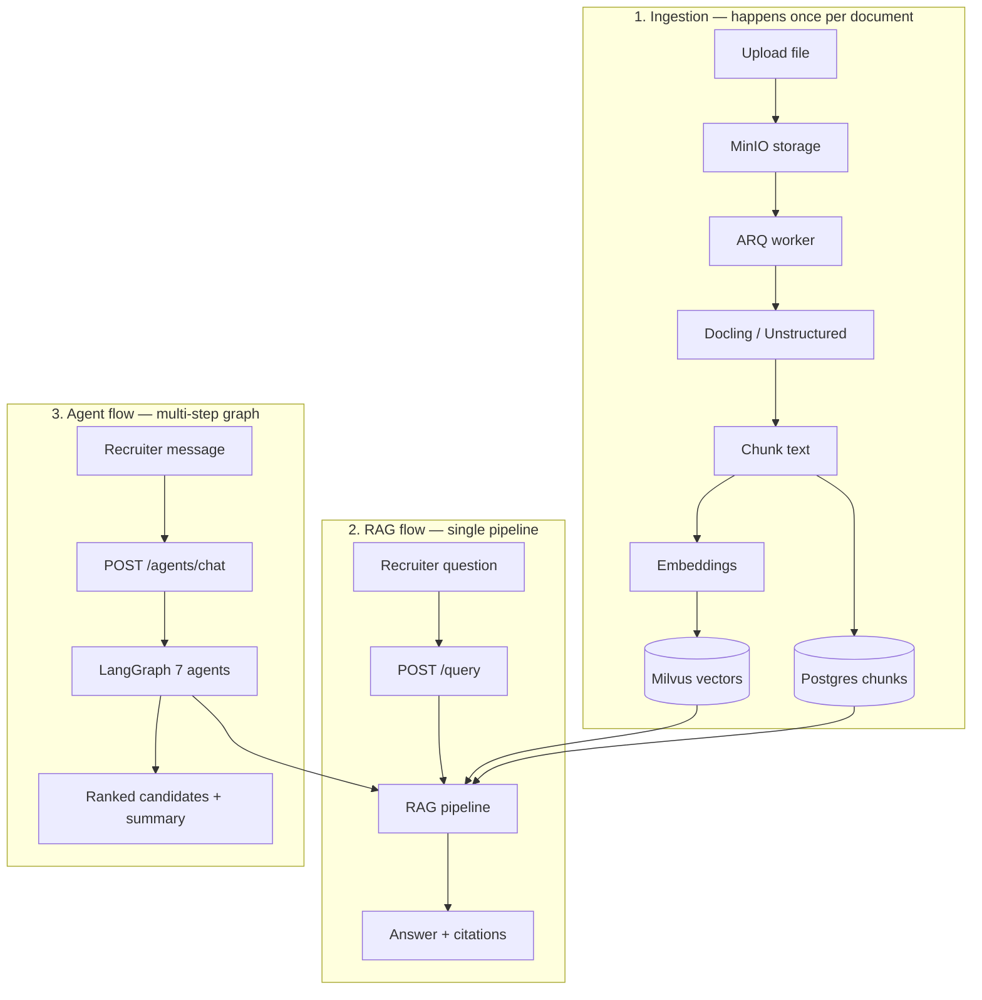

# TalentScreen — Beginner Learning Guide

A simple map of how everything works end-to-end. Read this first, then follow the **Learn more** links when you want depth.

---

## What is this project?

**TalentScreen** helps recruiters search hiring documents (resumes, job descriptions, interview notes) and compare candidates.

It has **two main modes**:

| Mode | What it does | Best for |
|------|----------------|----------|
| **RAG** | Find relevant text → generate a cited answer | “Who has Java and AWS?” |
| **Agents** | Multiple AI steps plan, retrieve, score, and rank candidates | “Who best fits this role?” |

Both use the **same documents** and **same vector database**. Agents call the RAG pipeline as one of their tools.

**Full architecture & timeline:** [PROJECT_PLAN.md](PROJECT_PLAN.md)

---

## Run the stack (5 minutes)

```bash
docker compose up -d
uv run talentscreen-api        # terminal 1
uv run talentscreen-worker     # terminal 2
./scripts/seed_synthetic_data.sh
```

Optional UI:

- **React:** `cd frontend/react && npm run dev` → http://localhost:5173  
- **Streamlit debug:** `uv run talentscreen-debug` → http://localhost:8501  

**Setup details:** [README.md](README.md)

---

## The big picture



---

## Flow 1 — Ingestion (documents → searchable)

**In plain English:** You upload a file. The system stores it, splits it into chunks, saves text in Postgres, and saves vectors in Milvus.

```
Upload → MinIO → Redis queue → Worker → Parse → Chunk → Postgres + Milvus
```

| Step | What happens | Code |
|------|----------------|------|
| Upload API | Receives file, stores in MinIO | `src/talentscreen/api/main.py` → `/ingest` |
| Queue job | Puts work on Redis (ARQ) | `src/talentscreen/ingestion/worker.py` |
| Pick parser | PDF/DOCX → Docling; txt/md → Unstructured | `src/talentscreen/ingestion/router.py` |
| Chunk | Split text with overlap | `src/talentscreen/ingestion/chunking.py` |
| Save | Chunks in Postgres; vectors in Milvus | `src/talentscreen/ingestion/pipeline.py` |
| Schema | Table definitions | `infra/sql/init.sql` |

**Demo data:** `data/synthetic/` (Alice, Bob, Carol resumes + Java job description)

**Learn more:** [docs/learning/phase1-rag.md](docs/learning/phase1-rag.md) (ingestion section)

---

## Flow 2 — RAG query (question → answer)

**In plain English:** You ask a question. The system cleans it, rewrites it, searches the database, reranks results, and asks the LLM to answer **only from retrieved chunks** (with citations).

```
Question → PII check → LLM rewrite → Cache? → Hybrid search → Rerank → LLM answer
```

| Step | What happens | Code |
|------|----------------|------|
| API entry | `POST /query` | `src/talentscreen/api/main.py` |
| Full pipeline | Orchestrates all steps below | `src/talentscreen/retrieval/pipeline.py` |
| PII redaction | Remove emails, phones, etc. | `src/talentscreen/guardrails/pii.py` |
| Query rewrite | 2–3 search variants (LLM) | `src/talentscreen/retrieval/query_rewrite.py` |
| Cache | Skip work if same query seen | `src/talentscreen/retrieval/cache.py`, `semantic_cache.py` |
| Hybrid search | Dense (Milvus) + keyword (BM25) fused | `src/talentscreen/retrieval/hybrid.py`, `bm25.py` |
| Milvus | Vector similarity search | `src/talentscreen/retrieval/milvus/client.py` |
| Rerank | Cross-encoder picks best chunks | `src/talentscreen/retrieval/rerank.py` |
| Generate answer | LLM + citation validation | `src/talentscreen/generation/rag.py` |
| Embeddings / LLM | Ollama locally (Bedrock in prod) | `src/talentscreen/generation/embeddings/`, `generation/llm/` |

**Try it:**

```bash
curl -X POST http://localhost:8000/query \
  -H 'Content-Type: application/json' \
  -d '{"query":"Who has Java and AWS?","retrieval_mode":"hybrid"}'
```

**UI:** React → Recruiter → **Search & Chat** → **RAG Search** tab  
`frontend/react/src/pages/recruiter/SearchChatPage.tsx`

**Learn more:** [docs/learning/phase1-rag.md](docs/learning/phase1-rag.md)  
**Eval (quality metrics):** `eval/run_golden_eval.py`, [eval/golden_sets/phase1b.json](eval/golden_sets/phase1b.json)

---

## Flow 3 — Agent chat (message → multi-agent → answer)

**In plain English:** You send a message. A **router** decides intent. An **orchestrator** builds a plan. Specialist agents run one by one (retrieve → analyze resumes → score fit → check bias → manage conversation). The orchestrator combines results into a final answer. High-impact decisions can pause for **human approval (HITL)**.

```
Message → Router → Summarize? → Plan → [Retrieval → Resume → Fit → Bias → Convo] → Aggregate → HITL? → Response
```

| Agent | Job | Code |
|-------|-----|------|
| **Router** | Hiring / policy / scheduling / reject | `src/talentscreen/agents/nodes/router.py` |
| **Summarization** | Compress long chat history | `src/talentscreen/agents/nodes/summarization.py` |
| **Orchestrator** | Plan + final summary | `src/talentscreen/agents/nodes/orchestrator.py` |
| **Retrieval** | Runs RAG tool, packages context | `src/talentscreen/agents/nodes/retrieval.py` |
| **Resume analysis** | Extract names, skills from chunks | `src/talentscreen/agents/nodes/resume_analysis.py` |
| **Candidate fit** | Score vs query skills + min years | `src/talentscreen/agents/nodes/candidate_fit.py` |
| **Bias / fairness** | PII, biased language checks | `src/talentscreen/agents/nodes/bias_fairness.py` |
| **Conversation** | Clarifying questions | `src/talentscreen/agents/nodes/conversation_manager.py` |
| **HITL gate** | Pause for recruiter approve/reject | `src/talentscreen/agents/nodes/hitl.py` |

**Graph wiring (how nodes connect):** `src/talentscreen/agents/graph.py`  
**Shared state (what agents read/write):** `src/talentscreen/agents/state.py`  
**API:** `src/talentscreen/api/agents.py` → `POST /agents/chat`  
**Query skill parsing (e.g. AI/ML, min years):** `src/talentscreen/agents/query_parsing.py`

**Tools agents call:**

| Tool | Wraps | Code |
|------|--------|------|
| `rag_retrieve` | Full RAG pipeline | `src/talentscreen/agents/tools/rag.py` |
| `postgres_query` | Read-only SQL | `src/talentscreen/agents/tools/postgres.py` |
| `guardrails_check` | PII + bias heuristics | `src/talentscreen/agents/tools/guardrails.py` |

**Try it:**

```bash
curl -X POST http://localhost:8000/agents/chat \
  -H 'Content-Type: application/json' \
  -d '{"message":"Who has Java and AWS experience?"}'
```

**UI:** React → **Agent Chat** tab (markdown + candidate cards)  
**HITL approvals:** `/recruiter/approvals` → `GET /agents/pending`

**Learn more:** [docs/learning/phase2-agents.md](docs/learning/phase2-agents.md)  
**MCP wrappers (same tools, external protocol):** [docs/mcp/README.md](docs/mcp/README.md)

---

## RAG vs Agents — when to use which?

| | RAG (`/query`) | Agents (`/agents/chat`) |
|--|----------------|-------------------------|
| **Steps** | 1 pipeline | 7 agents + plan |
| **Output** | Answer + chunk citations | Ranked candidates + recommendation |
| **Speed** | Still slow locally (LLM + rerank) | Slower (RAG + multiple agents) |
| **Best query** | Factual lookup | Compare / shortlist / workflow |

Agents **reuse RAG** inside the Retrieval agent — they are not separate systems.

---

## Data stores (what lives where)

| Store | Holds | Why |
|-------|--------|-----|
| **Postgres** | Chunks, jobs, applications, agent checkpoints | Source of truth for text |
| **Milvus** | Embedding vectors keyed by `chunk_id` | Fast similarity search |
| **MinIO** | Raw uploaded files | S3-compatible blob storage |
| **Redis** | Query cache + ingestion queue | Speed + async jobs |
| **LangGraph state** | Plan, task results, messages | Agent “blackboard” (in memory or Postgres) |

**AWS production mapping:** [docs/aws-mapping.md](docs/aws-mapping.md)  
**Terraform reference:** [infra/aws/README.md](infra/aws/README.md)

---

## Suggested learning path

Read in this order:

1. **This file** — you are here  
2. [README.md](README.md) — run commands hands-on  
3. [docs/learning/phase1-rag.md](docs/learning/phase1-rag.md) — RAG deep dive  
4. [docs/learning/phase2-agents.md](docs/learning/phase2-agents.md) — agents deep dive  
5. [docs/learning/phase3-production.md](docs/learning/phase3-production.md) — React, auth, Terraform  
6. [docs/resume-justification.md](docs/resume-justification.md) — map resume bullets → code files  
7. [docs/narrative-alignment.md](docs/narrative-alignment.md) — interview talking points  
8. [PROJECT_PLAN.md](PROJECT_PLAN.md) — full build plan & decisions  

---

## Quick file finder

| I want to understand… | Open this |
|------------------------|-----------|
| Whole RAG pipeline | `src/talentscreen/retrieval/pipeline.py` |
| API routes | `src/talentscreen/api/main.py`, `agents.py` |
| Agent graph | `src/talentscreen/agents/graph.py` |
| Upload / ingest | `src/talentscreen/ingestion/` |
| React UI | `frontend/react/src/pages/recruiter/` |
| Config / env vars | `src/talentscreen/config.py`, `.env.example` |
| Tests | `tests/unit/` |
| Eval / quality | `eval/` |

---

## One-sentence summary

**Upload docs → chunk & embed → store in Postgres + Milvus → RAG answers questions from retrieved chunks → Agents orchestrate multiple steps on top of RAG to rank candidates and support recruiter workflows.**
